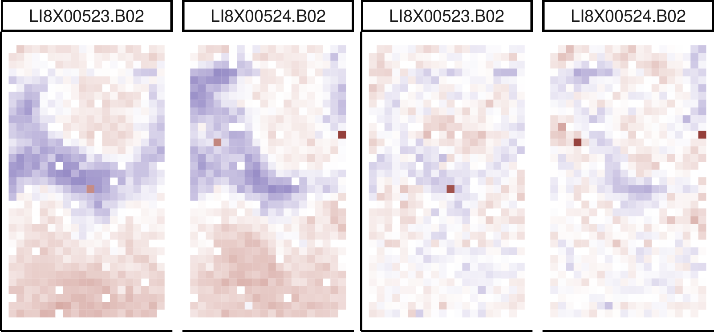

# Normalization of MEMAs

Leveraging design principles to normalize high-throughput plate-based imaging data like MEMAs.   
  
Our manuscript describing the method is available at Bioinformatics [here](https://doi.org/10.1093/bioinformatics/btac606)

A docker image reproducing our analysis is available [here](https://hub.docker.com/r/gjhunt/mema_norm)

This github also contains our analysis files and R packages. The data is too large to host on github so one should alternatively see our docker image on dockerhub [here](https://hub.docker.com/r/gjhunt/mema_norm) or docker image/full files on zenodo [here](..).

### Analysis files

Most important analysis files are

1. ``process.ipynb`` (or mirrored ``process.R`` and ``process.Rmd``)

This takes data from raw data to RR transformed data to RR and normalized data and saves it in various formats. Raw level 2 ``.tsv`` files are expected to be in the directory ``analysis/raw_data/MCF10A/``

2. ``analysis_plots.ipynb`` (or mirrored ``analysis_plots.R`` and ``analysis_plots.Rmd``)

This takes processed data and prodcues plots. This needs ``MCF10A_15_df.csv`` to be in the directory ``analysis/processed_data/csv/`` but doesn't require any of the lower-level data. 

### R packages

The underlying R package code for both the `rr` package and `memanorm` package may be found in the ``r_packages`` folder.